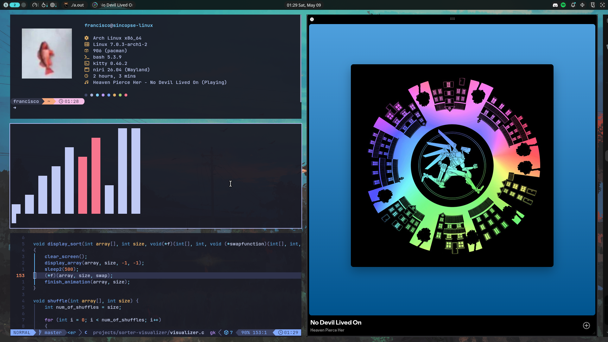

### Hi there! 👋

This are my linux installation dotfiles, curretly using GNU Stow for easy symlink creation. (I'm too lazy to learn to do a bash script).

I'll be adding what I think it's missing so I can easly update the configs between my pc and my laptop.

  

